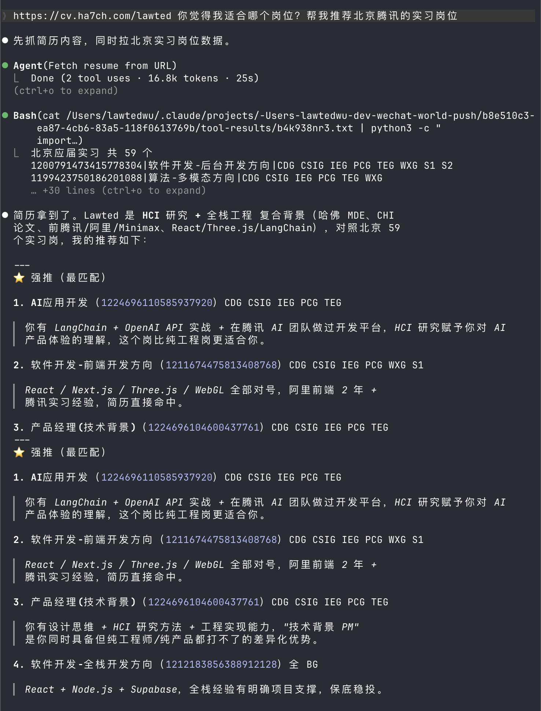
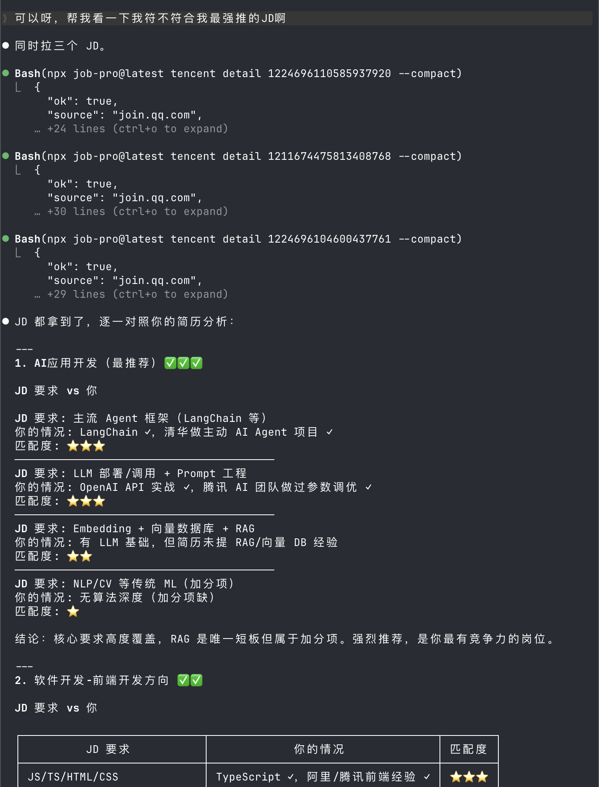
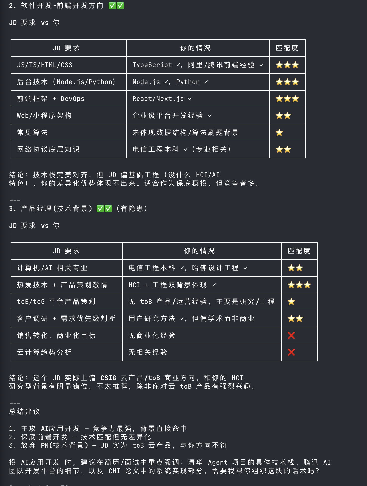

# job.pro

Query Chinese big-tech campus recruiting from your terminal — [job.ha7ch.com](https://job.ha7ch.com)

```bash
npx job-pro@latest tencent search "后台开发"
```

No signup, no token, no proxy server. The CLI talks straight to each company's
public API (e.g. `join.qq.com` for Tencent) and prints JSON. Pipe it into `jq`,
Claude Code, anything.

## Demo: hand it to Claude Code

Drop the prompt from [job.ha7ch.com](https://job.ha7ch.com) into Claude Code,
attach your resume, and let the agent drive the CLI end-to-end.

**1. It pulls the city's intern list and shortlists roles against your resume.**



**2. It pulls multiple JDs in parallel and grades each one line-by-line.**



**3. It hands you a final verdict — apply, fall back, or skip.**



## Install

```bash
npm i -g job-pro
job-pro --version
```

Or one-shot via `npx`:

```bash
npx job-pro@latest help
```

## What you can do today

```bash
# search & inspect jobs
job-pro tencent search "数据科学" --page-size 10
job-pro tencent detail 1200791473415778304
job-pro tencent all --page-size 100             # drain every open post

# announcements
job-pro tencent notices
job-pro tencent notice 284
job-pro tencent flow "腾讯2026实习什么时候开始" --question-time 2026-05-13

# resume tooling (all offline)
echo "..." | job-pro tencent match -
job-pro tencent resume-check resume.md

# local memory for tracking your hunt
job-pro tencent memory set "stack=Go,Python" "target_city=深圳"
job-pro tencent memory event applied "腾讯后台 1200791473415778304"
job-pro tencent memory list
```

Add `--compact` to any command for a single-line JSON output (pipe-friendly).

## Roadmap

| Company    | Get jobs | Auto-apply | Source                              |
|------------|----------|------------|-------------------------------------|
| Tencent    | ✅       | ⏳         | [`join.qq.com`](https://join.qq.com) |
| ByteDance  | ⏳       | ⏳         | jobs.bytedance.com                  |
| Didi       | ⏳       | ⏳         | talent.didiglobal.com               |
| Alibaba    | ⏳       | ⏳         | talent.alibaba.com                  |

`Auto-apply` is phase 2 — it needs login cookies / OAuth, not just the public
search endpoints. See [docs/auto-apply.md](./docs/auto-apply.md) for the plan.

## How it's built

- `cli/` — the npm package (TypeScript, zero runtime deps, Node 18+).
- `src/` — the [job.ha7ch.com](https://job.ha7ch.com) landing page (Next.js).
- `python-reference/` — the original Python port. Same endpoints, more
  comments. Useful if you want to read the code top-to-bottom.
- `docs/` — endpoint inventories per company.

## Why "local-direct" instead of a hosted backend

The data is public. We don't store anything on a server, don't see your
queries, don't rate-limit you, can't go down. The flipside: you get the
upstream's quirks (typos in field names, etc.) — we paper over them in the
client, but if the upstream changes, the CLI may need a release.

## Credit

The endpoint inventory for `join.qq.com` was recovered by inspecting the
official Tencent WorkBuddy skill bundle. We re-implemented the client in
both Python and TypeScript with our own structure, naming, and matching
heuristics. No prompt copy, no documentation copy, no skill body is reused.

## Contributing

Adding a new company is mechanical:
1. Find its public listing/detail API (DevTools → Network on the careers
   site).
2. Add a `cli/src/<company>.ts` mirroring `tencent.ts`.
3. Wire it into `cli/src/index.ts`.
4. Add a row to the roadmap above.
5. Open a PR.

The auto-apply phase needs more thought — see the roadmap doc.

## License

MIT — see [LICENSE](./LICENSE).
